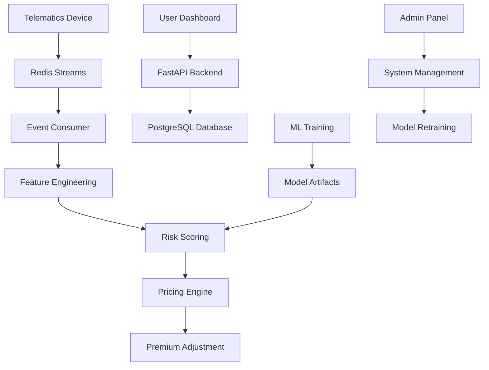

# Architecture Overview

## System Architecture

The Telematics UBI system is built as a microservices architecture with the following components:

### Core Components

1. **FastAPI Backend** (`/src/backend/`)
   - RESTful API for telematics data ingestion
   - User authentication and authorization
   - Risk scoring and pricing endpoints
   - Admin management interfaces

2. **React Frontend** (`/src/frontend/`)
   - User dashboard for trip visualization
   - Risk score monitoring and insights
   - Admin panel for system management
   - Real-time data visualization

3. **PostgreSQL Database** (with TimescaleDB)
   - User and vehicle management
   - Telematics event storage
   - Risk scores and pricing history
   - Time-series optimization for GPS data

4. **Redis Streams**
   - Real-time telematics event processing
   - Message queuing for scalability
   - Event aggregation and trip detection

5. **ML Pipeline** (`/src/backend/ml/`)
   - Feature engineering from telematics data
   - Risk scoring models (classification + regression)
   - Model training and evaluation
   - SHAP explainability

6. **Pricing Engine** (`/src/backend/pricing/`)
   - Dynamic premium calculation
   - Risk band-based adjustments
   - Pricing rule validation and fairness

### Data Flow



### Technology Stack

- **Backend**: Python 3.11, FastAPI, SQLAlchemy, Pydantic
- **Database**: PostgreSQL + TimescaleDB extension
- **Streaming**: Redis Streams
- **ML**: scikit-learn, XGBoost, SHAP
- **Frontend**: React 18, TypeScript, Tailwind CSS, Vite
- **Infrastructure**: Docker, Docker Compose
- **Monitoring**: Prometheus, Grafana

### Security Architecture

- **Authentication**: JWT tokens with secure password hashing
- **Authorization**: Role-based access control (user/admin)
- **Data Privacy**: GPS coordinate bucketization, PII minimization
- **API Security**: Rate limiting, CORS protection, input validation

### Scalability Considerations

- **Horizontal Scaling**: Stateless API services
- **Database**: Read replicas, connection pooling
- **Caching**: Redis for session and computed scores
- **Message Queues**: Redis Streams for event processing
- **Monitoring**: Prometheus metrics, health checks

## Component Details

### Backend API (`/src/backend/`)

The backend is organized into several modules:

- **`/api/`**: FastAPI route handlers
- **`/core/`**: Authentication, security, dependencies
- **`/db/`**: Database models, schemas, CRUD operations
- **`/ml/`**: Machine learning pipeline and scoring
- **`/pricing/`**: Dynamic pricing engine
- **`/stream/`**: Redis Streams producer/consumer

### Frontend Application (`/src/frontend/`)

React application with the following structure:

- **`/components/`**: Reusable UI components
- **`/pages/`**: Route-based page components
- **`/hooks/`**: Custom React hooks
- **`/utils/`**: API client and utilities
- **`/types/`**: TypeScript type definitions

### Database Schema

Key entities:
- **Users**: Authentication and profile data
- **Vehicles**: Insured vehicle information
- **Policies**: Insurance policy details
- **Trips**: Aggregated telematics data
- **TelematicsEvents**: Raw GPS and sensor data
- **RiskScores**: Computed risk assessments
- **PremiumAdjustments**: Dynamic pricing changes

### ML Pipeline

1. **Feature Engineering**: Extract driving behavior metrics
2. **Model Training**: Classification (claim probability) + Regression (severity)
3. **Risk Scoring**: Combine models for expected loss calculation
4. **Explainability**: SHAP values for model interpretability

### Pricing Engine

1. **Risk Band Mapping**: Score → Band (A-E) conversion
2. **Adjustment Calculation**: Band → Premium delta mapping
3. **Guardrails**: Maximum changes, cooldown periods
4. **Fairness**: Monotonicity and bias detection

## Deployment Architecture

### Development Environment

```yaml
services:
  - api: FastAPI backend
  - frontend: React development server
  - db: PostgreSQL with TimescaleDB
  - redis: Redis Streams
  - prometheus: Metrics collection
  - grafana: Monitoring dashboard
```

### Production Considerations

- **Load Balancing**: Multiple API instances
- **Database**: Primary/replica setup with failover
- **Monitoring**: Centralized logging and alerting
- **Security**: HTTPS, API keys, network isolation
- **Backup**: Automated database backups
- **CI/CD**: Automated testing and deployment

## Performance Characteristics

### Expected Loads

- **Users**: 10,000+ concurrent users
- **Events**: 1M+ telematics events per day
- **API Calls**: 100K+ requests per hour
- **Scoring**: Real-time + batch processing

### Optimization Strategies

- **Database**: Indexing, partitioning, query optimization
- **Caching**: Redis for frequently accessed data
- **Async Processing**: Background tasks for heavy operations
- **CDN**: Static asset delivery
- **Connection Pooling**: Database connection management

## Monitoring and Observability

### Metrics Collection

- **Application**: Request rates, response times, error rates
- **Infrastructure**: CPU, memory, disk, network usage
- **Business**: User registrations, trip counts, score distributions
- **ML**: Model performance, prediction accuracy

### Alerting

- **System Health**: Service availability, error rates
- **Performance**: Response time degradation
- **Business**: Unusual score patterns, pricing anomalies
- **Security**: Authentication failures, suspicious activity

### Logging

- **Structured Logging**: JSON format with correlation IDs
- **Log Levels**: DEBUG, INFO, WARNING, ERROR, CRITICAL
- **Retention**: 30 days for application logs, 1 year for audit logs
- **Privacy**: PII redaction, GPS coordinate masking
