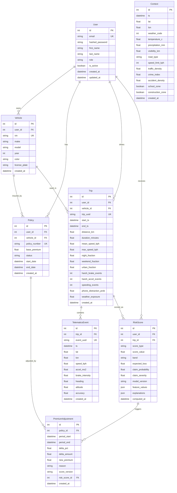

# Data Model Documentation

## Entity Relationship Diagram



## Table Definitions

### Users Table

Stores user authentication and profile information.

```sql
CREATE TABLE users (
    id SERIAL PRIMARY KEY,
    email VARCHAR(255) UNIQUE NOT NULL,
    hashed_password VARCHAR(255) NOT NULL,
    first_name VARCHAR(100),
    last_name VARCHAR(100),
    role VARCHAR(50) DEFAULT 'user' NOT NULL,
    is_active BOOLEAN DEFAULT TRUE NOT NULL,
    created_at TIMESTAMP WITH TIME ZONE DEFAULT NOW(),
    updated_at TIMESTAMP WITH TIME ZONE
);

CREATE INDEX idx_users_email ON users(email);
CREATE INDEX idx_users_role ON users(role);
```

### Vehicles Table

Stores insured vehicle information.

```sql
CREATE TABLE vehicles (
    id SERIAL PRIMARY KEY,
    user_id INTEGER NOT NULL REFERENCES users(id),
    vin VARCHAR(17) UNIQUE NOT NULL,
    make VARCHAR(50) NOT NULL,
    model VARCHAR(50) NOT NULL,
    year INTEGER NOT NULL CHECK (year >= 1900 AND year <= 2030),
    color VARCHAR(30),
    license_plate VARCHAR(20),
    created_at TIMESTAMP WITH TIME ZONE DEFAULT NOW()
);

CREATE INDEX idx_vehicles_user_id ON vehicles(user_id);
CREATE INDEX idx_vehicles_vin ON vehicles(vin);
```

### Policies Table

Stores insurance policy information.

```sql
CREATE TABLE policies (
    id SERIAL PRIMARY KEY,
    user_id INTEGER NOT NULL REFERENCES users(id),
    vehicle_id INTEGER NOT NULL REFERENCES vehicles(id),
    policy_number VARCHAR(50) UNIQUE NOT NULL,
    base_premium DECIMAL(10,2) NOT NULL CHECK (base_premium > 0),
    status VARCHAR(20) DEFAULT 'active' NOT NULL,
    start_date TIMESTAMP WITH TIME ZONE NOT NULL,
    end_date TIMESTAMP WITH TIME ZONE NOT NULL CHECK (end_date > start_date),
    created_at TIMESTAMP WITH TIME ZONE DEFAULT NOW()
);

CREATE INDEX idx_policies_user_id ON policies(user_id);
CREATE INDEX idx_policies_vehicle_id ON policies(vehicle_id);
CREATE INDEX idx_policies_status ON policies(status);
```

### Trips Table (TimescaleDB Hypertable)

Stores aggregated telematics data for each trip.

```sql
CREATE TABLE trips (
    id SERIAL PRIMARY KEY,
    user_id INTEGER NOT NULL REFERENCES users(id),
    vehicle_id INTEGER NOT NULL REFERENCES vehicles(id),
    trip_uuid VARCHAR(36) UNIQUE NOT NULL,
    start_ts TIMESTAMP WITH TIME ZONE NOT NULL,
    end_ts TIMESTAMP WITH TIME ZONE NOT NULL,
    distance_km DECIMAL(10,2) NOT NULL CHECK (distance_km >= 0),
    duration_minutes DECIMAL(10,2) NOT NULL CHECK (duration_minutes > 0),
    mean_speed_kph DECIMAL(5,2) NOT NULL CHECK (mean_speed_kph >= 0),
    max_speed_kph DECIMAL(5,2) NOT NULL CHECK (max_speed_kph >= 0),
    night_fraction DECIMAL(3,2) NOT NULL CHECK (night_fraction >= 0 AND night_fraction <= 1),
    weekend_fraction DECIMAL(3,2) NOT NULL CHECK (weekend_fraction >= 0 AND weekend_fraction <= 1),
    urban_fraction DECIMAL(3,2) NOT NULL CHECK (urban_fraction >= 0 AND urban_fraction <= 1),
    harsh_brake_events INTEGER DEFAULT 0 NOT NULL CHECK (harsh_brake_events >= 0),
    harsh_accel_events INTEGER DEFAULT 0 NOT NULL CHECK (harsh_accel_events >= 0),
    speeding_events INTEGER DEFAULT 0 NOT NULL CHECK (speeding_events >= 0),
    phone_distraction_prob DECIMAL(3,2) DEFAULT 0.0 NOT NULL CHECK (phone_distraction_prob >= 0 AND phone_distraction_prob <= 1),
    weather_exposure DECIMAL(3,2) DEFAULT 0.0 NOT NULL CHECK (weather_exposure >= 0 AND weather_exposure <= 1),
    created_at TIMESTAMP WITH TIME ZONE DEFAULT NOW()
);

-- Convert to TimescaleDB hypertable
SELECT create_hypertable('trips', 'start_ts', chunk_time_interval => INTERVAL '1 day');

CREATE INDEX idx_trips_user_id ON trips(user_id);
CREATE INDEX idx_trips_vehicle_id ON trips(vehicle_id);
CREATE INDEX idx_trips_start_ts ON trips(start_ts);
CREATE INDEX idx_trips_end_ts ON trips(end_ts);
```

### TelematicsEvents Table (TimescaleDB Hypertable)

Stores individual telematics events (GPS + sensor data).

```sql
CREATE TABLE telematics_events (
    id SERIAL PRIMARY KEY,
    trip_id INTEGER NOT NULL REFERENCES trips(id),
    event_uuid VARCHAR(36) UNIQUE NOT NULL,
    ts TIMESTAMP WITH TIME ZONE NOT NULL,
    lat DECIMAL(10,5) NOT NULL CHECK (lat >= -90 AND lat <= 90),
    lon DECIMAL(10,5) NOT NULL CHECK (lon >= -180 AND lon <= 180),
    speed_kph DECIMAL(5,2) NOT NULL CHECK (speed_kph >= 0),
    accel_ms2 DECIMAL(6,3) NOT NULL,
    brake_intensity DECIMAL(3,2) NOT NULL CHECK (brake_intensity >= 0 AND brake_intensity <= 1),
    heading DECIMAL(6,2),
    altitude DECIMAL(8,2),
    accuracy DECIMAL(6,2),
    created_at TIMESTAMP WITH TIME ZONE DEFAULT NOW()
);

-- Convert to TimescaleDB hypertable
SELECT create_hypertable('telematics_events', 'ts', chunk_time_interval => INTERVAL '1 hour');

CREATE INDEX idx_telematics_trip_id ON telematics_events(trip_id);
CREATE INDEX idx_telematics_ts ON telematics_events(ts);
CREATE INDEX idx_telematics_location ON telematics_events(lat, lon);
```

### Context Table (TimescaleDB Hypertable)

Stores contextual data (weather, road conditions, etc.).

```sql
CREATE TABLE context (
    id SERIAL PRIMARY KEY,
    ts TIMESTAMP WITH TIME ZONE NOT NULL,
    lat DECIMAL(10,5) NOT NULL CHECK (lat >= -90 AND lat <= 90),
    lon DECIMAL(10,5) NOT NULL CHECK (lon >= -180 AND lon <= 180),
    weather_code INTEGER,
    temperature_c DECIMAL(5,2),
    precipitation_mm DECIMAL(6,2),
    visibility_km DECIMAL(6,2),
    road_type VARCHAR(50),
    speed_limit_kph INTEGER,
    traffic_density DECIMAL(3,2),
    crime_index DECIMAL(6,2),
    accident_density DECIMAL(8,2),
    school_zone BOOLEAN DEFAULT FALSE NOT NULL,
    construction_zone BOOLEAN DEFAULT FALSE NOT NULL,
    created_at TIMESTAMP WITH TIME ZONE DEFAULT NOW()
);

-- Convert to TimescaleDB hypertable
SELECT create_hypertable('context', 'ts', chunk_time_interval => INTERVAL '1 day');

CREATE INDEX idx_context_ts ON context(ts);
CREATE INDEX idx_context_location ON context(lat, lon);
CREATE INDEX idx_context_weather ON context(weather_code);
```

### RiskScores Table (TimescaleDB Hypertable)

Stores computed risk scores for users and trips.

```sql
CREATE TABLE risk_scores (
    id SERIAL PRIMARY KEY,
    user_id INTEGER NOT NULL REFERENCES users(id),
    trip_id INTEGER REFERENCES trips(id),
    score_type VARCHAR(20) NOT NULL,
    score_value DECIMAL(5,2) NOT NULL CHECK (score_value >= 0 AND score_value <= 100),
    band VARCHAR(1) NOT NULL CHECK (band IN ('A', 'B', 'C', 'D', 'E')),
    expected_loss DECIMAL(10,2) NOT NULL CHECK (expected_loss >= 0),
    claim_probability DECIMAL(6,4) NOT NULL CHECK (claim_probability >= 0 AND claim_probability <= 1),
    claim_severity DECIMAL(10,2) NOT NULL CHECK (claim_severity >= 0),
    model_version VARCHAR(50) NOT NULL,
    feature_values JSONB,
    explanations JSONB,
    computed_at TIMESTAMP WITH TIME ZONE DEFAULT NOW()
);

-- Convert to TimescaleDB hypertable
SELECT create_hypertable('risk_scores', 'computed_at', chunk_time_interval => INTERVAL '1 day');

CREATE INDEX idx_risk_scores_user_id ON risk_scores(user_id);
CREATE INDEX idx_risk_scores_trip_id ON risk_scores(trip_id);
CREATE INDEX idx_risk_scores_computed_at ON risk_scores(computed_at);
CREATE INDEX idx_risk_scores_score_type ON risk_scores(score_type);
```

### PremiumAdjustments Table

Stores premium adjustments based on risk scores.

```sql
CREATE TABLE premium_adjustments (
    id SERIAL PRIMARY KEY,
    policy_id INTEGER NOT NULL REFERENCES policies(id),
    period_start TIMESTAMP WITH TIME ZONE NOT NULL,
    period_end TIMESTAMP WITH TIME ZONE NOT NULL,
    delta_pct DECIMAL(5,4) NOT NULL CHECK (delta_pct >= -0.5 AND delta_pct <= 0.5),
    delta_amount DECIMAL(10,2) NOT NULL,
    new_premium DECIMAL(10,2) NOT NULL CHECK (new_premium > 0),
    reason TEXT,
    score_version VARCHAR(50) NOT NULL,
    risk_score_id INTEGER REFERENCES risk_scores(id),
    created_at TIMESTAMP WITH TIME ZONE DEFAULT NOW()
);

CREATE INDEX idx_premium_adjustments_policy_id ON premium_adjustments(policy_id);
CREATE INDEX idx_premium_adjustments_period ON premium_adjustments(period_start, period_end);
```

## Data Types and Constraints

### Common Data Types

- **SERIAL**: Auto-incrementing integer primary keys
- **VARCHAR(n)**: Variable-length strings with length limits
- **DECIMAL(p,s)**: Fixed-point decimal numbers (precision, scale)
- **TIMESTAMP WITH TIME ZONE**: Timezone-aware timestamps
- **JSONB**: Binary JSON for flexible data storage
- **BOOLEAN**: True/false values

### Privacy and Security Constraints

- **GPS Precision**: Latitude/longitude rounded to 5 decimal places (~1m precision)
- **PII Minimization**: No sensitive personal data in event logs
- **Data Retention**: Configurable retention policies for raw events
- **Access Control**: Row-level security based on user ownership

### Performance Optimizations

- **TimescaleDB Hypertables**: Automatic partitioning for time-series data
- **Indexes**: Strategic indexing on frequently queried columns
- **Compression**: Automatic compression for older time-series data
- **Aggregation**: Pre-computed trip summaries to reduce query complexity

## Data Relationships

### One-to-Many Relationships

- User → Vehicles (one user can own multiple vehicles)
- User → Policies (one user can have multiple policies)
- User → Trips (one user can have many trips)
- Vehicle → Trips (one vehicle can be used in many trips)
- Trip → TelematicsEvents (one trip contains many events)

### Many-to-One Relationships

- Trip → User (many trips belong to one user)
- Trip → Vehicle (many trips use one vehicle)
- RiskScore → User (many scores for one user)
- PremiumAdjustment → Policy (many adjustments for one policy)

### Optional Relationships

- RiskScore → Trip (scores can be trip-specific or user-level)
- PremiumAdjustment → RiskScore (adjustments can reference specific scores)

## Data Validation Rules

### Business Rules

1. **Policy Dates**: End date must be after start date
2. **Trip Duration**: Must be positive and reasonable (< 24 hours)
3. **Speed Limits**: Speeds must be non-negative and reasonable (< 300 km/h)
4. **Risk Scores**: Must be between 0 and 100
5. **Premium Adjustments**: Must be within ±50% range

### Data Quality Rules

1. **GPS Coordinates**: Must be within valid lat/lon ranges
2. **VIN Format**: Must be exactly 17 characters
3. **Email Format**: Must be valid email format
4. **Phone Numbers**: Must be valid format if provided
5. **JSON Fields**: Must be valid JSON structure

## Backup and Recovery

### Backup Strategy

- **Full Backup**: Daily full database backup
- **Incremental Backup**: Hourly incremental backups
- **Point-in-Time Recovery**: WAL archiving for PITR
- **Cross-Region Replication**: Disaster recovery setup

### Data Retention

- **Raw Events**: 90 days (configurable)
- **Trip Summaries**: 2 years
- **Risk Scores**: 5 years
- **User Data**: Per privacy policy (typically 7 years)
- **Audit Logs**: 1 year
